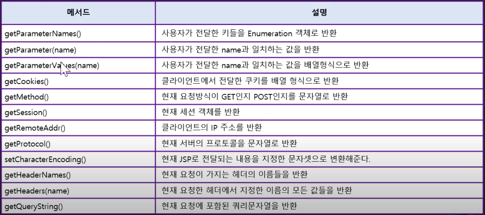
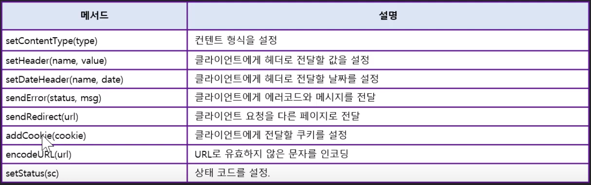
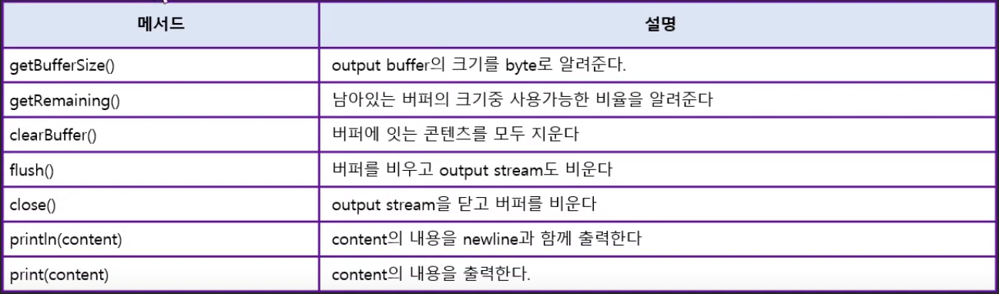
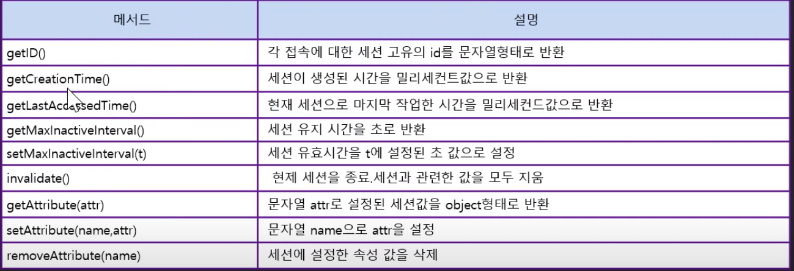
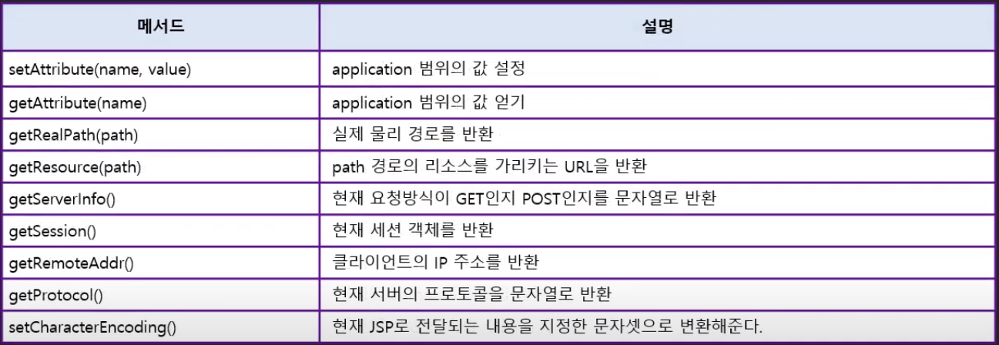
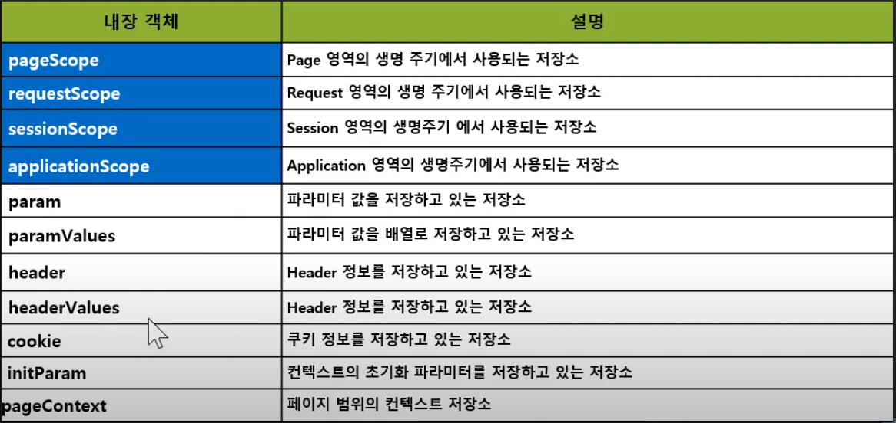
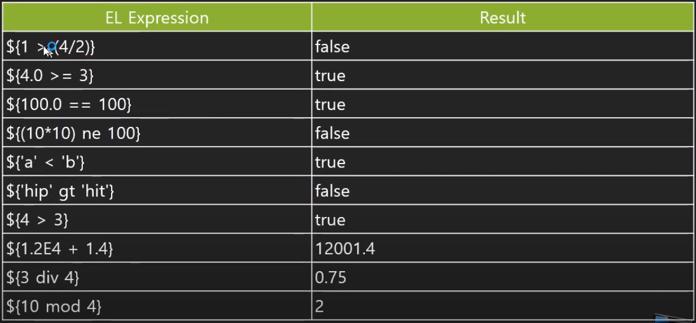

# JSP

- 동적 웹 프로그래밍을 할 수 있는 파일 형식으로 HTML 기준으로 자바코드를 삽입해 동적 웹 프로그래밍을 만든다.
- JSP는 웹브라우져에서 그대로 실행되는 것이 아니라 `Jasper`를 통해서 서블릿으로 변경되어 배포된다.

## 코드블럭


### 코드블럭1 : 출력코드 
```jsp
<!-- JSP파일 -->
Hello
```

```java
// Jasper로 변경된 서블릿 파일
public final class hello_jsp extends org.apache.jasper.runtime.HttpJspBase
    implements org.apache.jasper.runtime.JspSourceDependent,
    org.apache.jasper.runtime.JspSourceImports {


  public void _jspService(final javax.servlet.http.HttpServletRequest request, final javax.servlet.http.HttpServletResponse response)
      throws java.io.IOException, javax.servlet.ServletException {
            out.write("Hello");
    }

}
```

- Hello 라고 적은 JSP 파일은 Jasper를 통해 아래와 같은 JAVA파일로 변경된다.


### 코드블럭2 : 스크립트릿

```jsp
<!-- JSP파일 -->
y 값은 :

<!-- 스크립트릿 -->
<%
    out.print(y);
%>
```


```java
// Jasper로 변경된 서블릿 파일
public final class hello_jsp extends org.apache.jasper.runtime.HttpJspBase
    implements org.apache.jasper.runtime.JspSourceDependent,
    org.apache.jasper.runtime.JspSourceImports {


  public void _jspService(final javax.servlet.http.HttpServletRequest request, final javax.servlet.http.HttpServletResponse response)
      throws java.io.IOException, javax.servlet.ServletException {
        out.write("y값은 :");
        out.print(y);
    }

}
```

### 코드블럭3 : 표현식

```jsp
<!-- JSP파일 -->
y 값은 :
<!-- 표현식 -->
<%=
    y
%>
```


```java
// Jasper로 변경된 서블릿 파일
public final class hello_jsp extends org.apache.jasper.runtime.HttpJspBase
    implements org.apache.jasper.runtime.JspSourceDependent,
    org.apache.jasper.runtime.JspSourceImports {


  public void _jspService(final javax.servlet.http.HttpServletRequest request, final javax.servlet.http.HttpServletResponse response)
      throws java.io.IOException, javax.servlet.ServletException {
        out.write("y값은 :");
        out.print(y);
    }

}
```

### 코드블럭4 : 선언부(Declaration)


```jsp
<%! 
    public int sum(int a, int b){
        return a + b;
    }
%>
```


```java
// Jasper로 변경된 서블릿 파일
public final class hello_jsp extends org.apache.jasper.runtime.HttpJspBase
    implements org.apache.jasper.runtime.JspSourceDependent,
    org.apache.jasper.runtime.JspSourceImports {

    public int sum(int a, int b){
        return a + b;
    }      

  public void _jspService(final javax.servlet.http.HttpServletRequest request, final javax.servlet.http.HttpServletResponse response)
      throws java.io.IOException, javax.servlet.ServletException {

    }

}
```
- 함수 선언을 스크립트릿으로 하면 Service메서드 내부로 들어가게 되는 문제가 생긴다 `<%! %>`는 해당 Class내부에 선언하게 한다.


### 지시 블럭 : page 디렉티브

```jsp
<%@ page language="java" contentTyep="text/html; charset=UTF-8"
pageEncoding="UTF-8" %>
<html>
<head></head>
<body>
    ...
</body>
</html>
```
- 응답 헤더에 추가할 내용을 설정하는 페이지 디렉티브 내용이다. 서블릿에서 아래와 같이도 표현할 수 있는데 스크립트릿을 통해 해당 내용을 추가하면 jasper를 통해 서블릿으로 변경되었을때 서블릿 파일에 스크립트릿으로 작성한 것 위쪽에 다른 기본 내용들이 추가되기 때문에 스크립트릿으로 추가할 수는 없다.

```java
    response.setCharacterEncoding("UTF-8");
    response.setContentType("text/html; charset=UTF-8")    

```


## `JSP 내장객체`
- JSP의 내장(기본)객체는 Jasper를 통해 Servlet파일로 변경될 때 기본으로 선언해주는 객체들을 이야기한다.
    - request
    - response
    - pageContext
    - session
    - application
    - config
    - out
    - page


### request



### response




### out




### session



### application (Servlet Context)




## JSP MVC Model

- 컨트롤러와 뷰가 모델을 중심으로 분리하였으나, 물리적으로는 분리되지 않은 방식.

```jsp
<%@ page language="java" contentType="text/html; charset=UTF-8"
    pageEncoding="UTF-8"%>
	<%
		int num = 0;
		String tempNum = request.getParameter("num");
		
		if(tempNum != null&& !tempNum.equals(""))
		{
			num = Integer.parseInt(tempNum);	
		}	
	%>

<!DOCTYPE html>
<html>
<head>
<meta charset="UTF-8">
<title>Insert title here</title>
</head>
<body>
	<% if(num%2!=0){ %>
		홀수입니다
	<%}e`lse {  %>
		짝수입니다.
	<%} %>
</body>
</html>

```

### MVC Model 1

```jsp
<!-- 입력코드 Controller -->
<%@ page language="java" contentType="text/html; charset=UTF-8"
    pageEncoding="UTF-8"%>
	<%
		int num = 0;
		String tempNum = request.getParameter("num");
		String model="";
		if(tempNum != null&& !tempNum.equals(""))
		{
			num = Integer.parseInt(tempNum);	
		}
        if(num%2!=0){
            model = "홀수";
        }else
        {
            model = "짝수";
        }	
	%>
<!-- 출력코드 View -->
<!DOCTYPE html>
<html>
<head>
<meta charset="UTF-8">
<title>Insert title here</title>
</head>
<body>
    <!-- 출력데이터 Model -->
	<%=model%>입니다.
</body>
</html>
<!-- 출력데이터를 이용해 입력부와 출력부를 분리하는 것 -->
```

> 위 코드를 아래와 같이 변경하면서 코드블럭을 한쪽으로 모을 수 있다. Model을 이용해 코드를 출력 입력부분을 분리 하는것을 `Model 1` 이라고 함


### MVC Model 2

- 컨트롤라와 뷰가 물리적으로 분리된 방식

#### Controller
```java
@WebServlet("/spag")
public class Spag extends HttpServlet {
/* Controller */
	@Override
	protected void doGet(HttpServletRequest request, HttpServletResponse response) throws ServletException, IOException {
		int num = 0;
		String tempNum = request.getParameter("num");
		String model="";
		if(tempNum != null&& !tempNum.equals(""))
		{
			num = Integer.parseInt(tempNum);	
		}
        if(num%2!=0){
            model = "홀수";
        }else
        {
            model = "짝수";
        }
        
        request.setAttribute("model", model);
        
        //redirect
        // 새로운 요청을 하도록 만드는것 (일을 새로 요청)
        //forward
        // 일을 이어갈 수 있도록 정보를 담아 요청
        RequestDispatcher dispatcher 
        	= request.getRequestDispatcher("spag.jsp");
        dispatcher.forward(request, response);
	}
	
}
```

### View,Model
```jsp
<%@ page language="java" contentType="text/html; charset=UTF-8"
    pageEncoding="UTF-8"%>

<!-- 출력코드 View -->
<!DOCTYPE html>
<html>
<head>
<meta charset="UTF-8">
<title>Insert title here</title>
</head>
<body>
    <!-- 출력데이터 Model -->
	<%=request.getAttribute("model")%>입니다.
</body>
</html>
```

- Controller를 실행하면 forward형식으로 request에 생성한 Model을 담아 View로 가져와 출력하는 방식.
- 두 코드를 물리적으로 분리하였다.


## EL(Expression Language)

```java
// Controller

request.setAttribute("model",30);
```
```jsp
    <!-- View,Model -->

	<%=request.getAttribute("model");%>입니다.
	<!-- 스크립트릿 -->
    ${model}입니다.
    <!-- EL -->
```
- 표현식을 복잡한 내용을 간단 하게 표현할 수 있도록 한다.

```java
// Controller

List list = new ArrayList(){"1","test"...};
request.setAttribute("list",list);
```
```jsp
    <!-- View,Model -->

	<%=((List)request.getAttribute("list")).get(0)%>입니다.
	<!-- 스크립트릿 -->
    ${list[0]}입니다.
    <!-- EL -->
```

```java
Map n = new HashMap("title","제목");
request.setAttribute("n",n);
```
```jsp
<%=((Map)request.getAttribute("n")).get("title") %>
${n.title}
```


## EL 데이터 저장소


>저장객체 : page -> request -> session -> application

- setAttribute를 통해서 저장할 수 있는 대표 4가지 저장소
    - pageContext
        - page영역 ( 같은 페이지에서만 유효 )
    - request
        - 요청영역동은 유효함
    - session
        - 세션영역에서 유효함
    - application
        - 어플리케이션 영역에서 유효함.
- 대표적인 것 외에 전부



- EL에서 각 저장소가 같은 속성명을 가질 때 가져오는(추출하는) `우선순위`
    1. pageContext
    1. request
    1. session
    1. application

- EL에서 우선순위와 상관없이 사용하는 저장소 지정하는 방법
    - 한정사를 사용한다.
        - ${sessionScope.model}


- EL에 다양한 사용법

```jsp
	${param.num}<br/>
    <!-- num 파라미터 출력-->
	${header.accept}
    <!-- header에서 accept정보 출력 -->
```

```jsp
<%= pageContext.getRequest().getMethod %>

${pageContext.request.method}
```
- EL은 get메서드를 사용할 수 있는데 get은 제외하고 소문자로 하며 (괄호)를 없애고 사용한다. 


### EL 정리

- EL에서 사용할 수 있는 표기들
```
[] .
()
not ! empty
* / div % mod
+ -
< > <= >= lt gt le ge
== != eq ne
&& and
|| or
? :
```

- EL 사용 예

