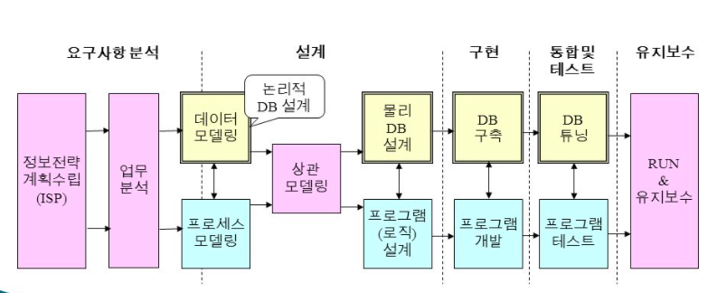
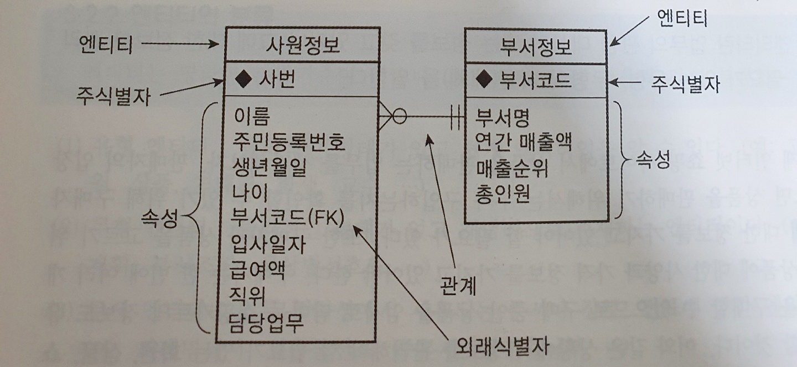
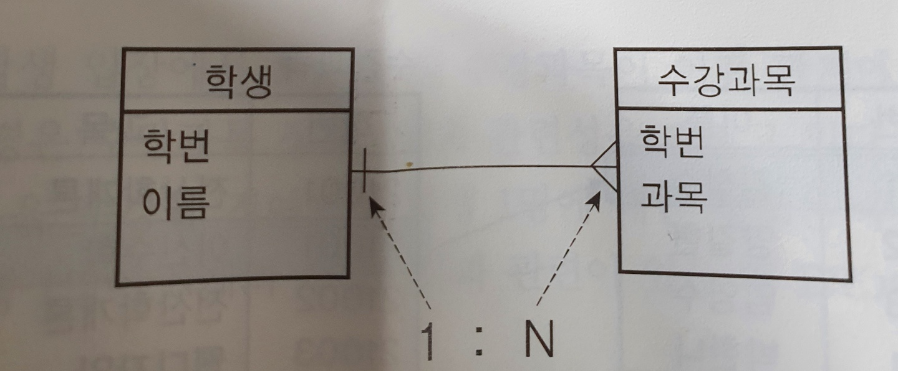
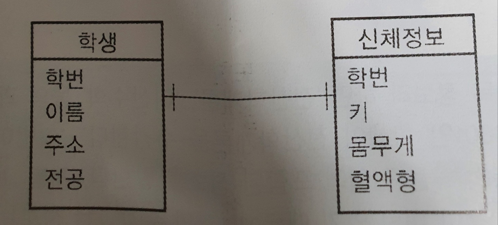
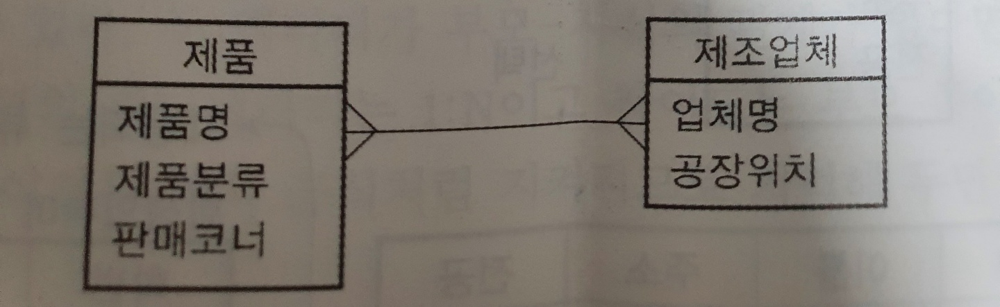
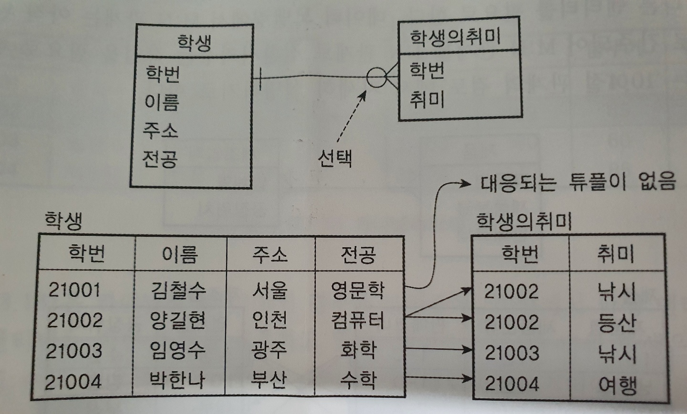
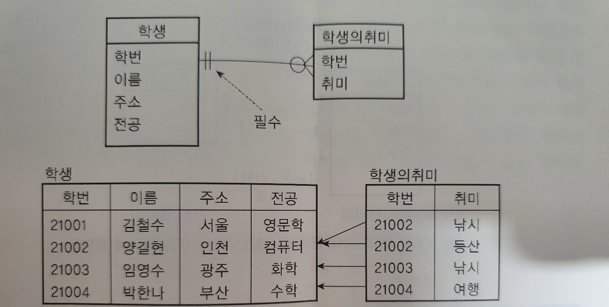

uㅕ---
title: 데이터베이스 설계
author: 손현호
---

## 정보 시스템 구축 절차, 데이터베이스 설계
- `모델`이란 사람들이 복잡한 현실세계를 쉽게 이해하기 위해 현실세계를 개념화
- 모델을 만드는 과정을 `모델링`이라 하며 다른 말로 `현실세계의 추상화`라고 한다.
- 소프트웨어는 현실세계를 추상화 하여 모델링한 결과.

### 데이터베이스 설계
- 현실세계의 개체가 데이터베이스 내부에 데이터라는 형태로 존재하는 것
- 현실세계를 `개념적 모델`로 표현하는 것으로 개념적 모델은 보통 `ERD(Entity-Relationship-Diagram)`를 이용해 표현
- 개념적 모델로 표현하고, 이를 바탕으로 데이터 베이스 구축을 진행하는 것을 `데이터베이스 설계`라고 함
- `논리적 데이터베이스 설계(logical database design)`와`물리적 데이터베이스 설계(physical database design)`로 나뉨
    - `논리적 데이터베이스 설계` : 현실세계를 관찰,분석하여 ERD로 불리는 개념적 모델을 만드는 과정
    - `물리적 데이터베이스 설계` : 논리적 데이터설계를 바탕으로 `테이블,인덱스,뷰`등을 설계하고 `반정규화`를 시행하는 과정

### 정보시스템 구축

데이터베이스 설계는 정보시스템 구축 과정의 일부이다. 정보시스템은 아래와 같은 개발 절차에 따른다.

    요구사항 분석 -> 설계 -> 구현 -> 통합 및 테스트 -> 유지보수

정보시스템은 다른 S/W와 달리 대부분 데이터베이스 기반으로 개발이 이루어지며, 아래와 같은 개발 방법론을 따른다. ( 노랑색이 데이터베이스 설계 영역 )

#### 정보전략 계획 수립(Information Strategic Planning)
- 기업의 경영전략 및 장단점 분석, 현행 업무 절차 평가, 새로운 전략 설정.

#### 업무 분석
-  현실 세계에서 업무가 어떻게 진행되는지 파악.

#### 데이터 모델링
- 현실세계를 데이터 관점으로 파악, 개념적 모델로 표현하는 단계.
- `논리적 데이터베이스 설계`
- ERD(Entity-Relationship-Diagram)를 가장 많이 사용

#### 프로세스 모델링
- 업무의 구성, 처리 절차와 방법을 파악하는 것.
- `기능분해도, 프로세스 흐름도`등이 사용됨

#### 상관 모델링
- 데이터 모델링과 프로세스 모델링을 비교 검토하여 잘 맞는지 평가하는 단계
- CRUD 매트릭스가 많이 이용됨.

#### 물리적 DB 설계
- 테이블, 뷰, 인덱스, 용량등을 설계
- `용량, 성능, 보안요소`등도 고려한다.
- 대표적인 산출물은 `테이블 기술서`등이 있다.

#### 데이터베이스 구축
- 물리적DB설계 내용을 가지고 실제로 구축하는 작업

#### 데이터베이스 튜닝
- DB가 일정 성능 유지를 위해 비효율적인 요소를 제거

## 데이터 모델링의 주요 개념

### 데이터 모델링
- 엔티티(ENTITY), 속성(attribute), 관계(relationship)을 사용하여 현실세계를 표현한다.
- 현실세계를 분석하고 모델링을 수행하면서 결과물로 ERD를 표현한다.

- #### 데이터베이스 와 모델링 용어비교
|DB용어|모델링 용어|
|:------------:|:-------------------:|
|테이블(table)|엔티티(entity)|
|컬럼(column),열|속성(attribute)|
|튜플(tuple),행(row)|인스턴스(instance)|
|기본키(primary key)|주식별자(primary identifier)|
|외래키(foreign key)|외래식별자(foreign identifier)|

---
### `엔티티`
- 엔티티는 업무의 관심 대상이 되는 `정보를 갖고 있거나 그에 대한 정보를 관리할 필요가 있는` 유형, 무형의 사물(`개체`)을 말함.
- 객체지향개념에서는 엔티티는 클래스 인스턴스는 객체로 구분된다.
- 데이터베이스에서는 엔티티는 테이블 인스턴스는 튜플로 구분된다.

#### 엔티티의 분류
1. 유형 엔티티
    - 물리적 형태가 있는 엔티티
    - ex) 고객, 상품,거래처,사원,학생,교수...
1. 무형 엔티티0
    - 개념적으로 전재하는 엔티티
    - ex) 생산계획, 부서조직, 생상별 선호도...
1. 문서 엔티티
    - 문서나 장부,전표에 대한 엔티티
    - ex) 거래명세서, 입출금전표, 주문서, 금전출납부, ...
1. 이력 엔티티
    - 업무상 반복적으로 이루어지는 행위나 사건의 내욜을 일자별, 시간별로 저장하기 위한 엔티티
    - ex) 입고이력, 출고이력,...
1. 코드 엔티티
    - 무형 엔티티의 일종으로 각종 코드를 분류하개 위한 엔티티
    - ex) 국가코드, 생상코드, 직급분류코드, 상태코드 ...

#### 성질
- 업무의 필요성
    - 엔티티는 업무의 관심 대상이 되어야함.
- 두 개 이상의 인스턴스 포함
    - 엔티티가 의미가 있기 위해서는 두 개 이상의 인스턴스가 확인 되어야함.
- 속성(Attribute)의 소유
    - 엔티티는 속성(Attribute)를 필수적으로 포함해야함.

---
### `속성(Attribute)`
- 속성이란 엔티티에서 관리해야 할 최소 단위의 정보 항목을 말함, 엔티티는 하나 이상의 속성을 포함.
- 현실세계에 다양한 정보중 `업무의 관심 항목만`을 속성으로 취함
    - 예를 들면 현실세계에서 한명의 회원이 이름, 성별, 주소, 생일, 연락처등 다양한 정보를 지니고 있을 것이다. 하지만 엔티티로 모델링 할 때는 필요한 속성말은 포함하여 만든다.
- 모델링의 속성은 테이블의 컬럼과 대응한다.

#### 속성의 분류
- 기본 속성(basicattribute)
    - 업무 분석 과정에서 업무의 관심 대상으로 분류된 정보 항목들로 전체 속성들 중 가장 많은 비중을 차지.
- 유도 속성(derived attribute)
    - 다른 송성의 값들로부터 유도될 수 있는 속성
- 설계 속성(designed attribute)
    - 정보시스템운영에 있어 필요해 강제로 만드는 속성으로 코드(code)속성이 대표적이다.

---

### `관계(RelationShip)`
- 엔티티 사이의 관련성을 나타내는 용어로 엔티티 사이의 `상호 공유 속성`이 있다는 의미.

### 관계의 카디낼러티(cardinality)
- 엔티티 사이의 관계를 구체적으로 표현하는 방법중 하나.
- `각 엔티티에 속해 있는 인스턴스들 간에 수적으로 어떤 관계가 있는지를 나타내는 개념`

> 엔티티는 나중에 테이블이 되고, 인스턴스는 튜플이 된다. 인스턴스 간의 관계는 튜플들 간의 관계로 해석할 수 있다.

  

### 카디낼러티의 종류

 

###  `1. 1:N 관계(one-to-many)`

  

> 학생의 하나의 `인스턴스`는 여러개의 수강과목 인스턴스와 관계를 가질 수 있고, 하나의 수강과목 `인스턴스`는 하나의 학생과 관계를 가질 수 있다. 이 때, `학생 엔티티와 수강과목 엔티티는 1:N의 관계에 있다`라고 한다.

   

###  `2. 1:1 관계(one-to-one)`

> 학생은 인스턴스는 하나의 신체정보 인스턴스를 가지고 그 반대도 마찬가지이다 이럴 때 우리는 `1:1 관계에 있다고 한다.` 이와 같이 1:1인 경우 두 엔티티를 하나로 합쳐도 되는데 이유가 있어서 두개로 나눈 경우에 해당한다.

   

### `3. M:N 관계 (many-to-many)`

> `M:N 관계`는  각 엔티티의 인스턴사 서로 여러개와 관계를 맺을 때를 의미한다. 예를 들어 MP3라는 제품명을 가진 제품의 인스턴스는 제조업체(삼성, LG, 애플)등 다수의 인스턴스와 관계를 맺을 수 있다. 이와 반대로 삼성 이라는 제조업체의 인스턴스는 MP3, 냉장고, TV등의 다양한 제품 인스턴스와 관계를 맺을 수 있다. 이와 같은 상황에 우리는 `M:N 관계`라고 한다.

> 이와 같이 M:N 관계에 있는 경우 두 엔티티가 관련있다는 정보를 두 엔티티만으로 표현할 수 없고 중간에 다른 엔티티를 필요로 한다. <u>데이터 모델링에서 M:N관계는 아직 완성되지 않은 모델로 간주되어 M:N모델을 1:N관계로 전환시켜주는 작업이 필요하다.</u>

### 관계의 참여도(partiality)
- 두 엔티티사이의 관계를 표현하는 카디낼러티와 다른 방법중 하나.
- `필수(mandatory)`와 `선택(optional)`이 있다.

#### 선택 관계

- 서로 관계를 맺고 있는 엔티티 사이에 엔티티의 인스턴스가 반드시 다른 엔티티의 인스턴스와 관계를 맺고 있지 않아도 될 때 우리는 그것을 `선택관계`라고 하며 아래와 같이 카디낼러티에 `동그라미`로 선택관계를 표시한다.

#### 필수 관계

- 서로 관계를 맺고 있는 엔티티 사이의 엔티티의 인스턴스가 관계를 맺고 있는 엔티티의 반드시 존재해야 할때 `필수관계`라고 하며 아래와 같이 카디낼러티에 `|`를 하나 더 써서 표현한다.

### 부모 엔티티와 자식 엔티티

- 상호 관계가 있는 두 엔티티는 부모-자식 관계에 있는 경우가 많다. <u>두 엔티티의 부모, 자식 여부는 어느 쪽에 정보가 먼저 생성이 되는가에 따라 결정된다.</u>
- 일반적으로 부모-자식 관계가 있다면 부모 엔티티와 자식엔티티는 `1:N 관계`이며, 참여도는 `부모 쪽이 필수`, `자식쪽이 선택`이다. .

- 학생과 학생의 취미 엔티티가 존재할 때 상식적으로 학생 엔티티가 먼저 작성되어야 학생 취미엔티티가 작성될 수 있을 것이다. 따라서 학생 엔티티가 부모엔티티 학생 취미 엔티티가 자식 엔티티라고 할 수 있다.

---
## 주식별자(primary identifier)와 외래식별자(Foreign identifier)

- `주식별자는 기본키, 외래식별자는 외래키`, 보조식별자는 대체키와 대응된다.
- 주식별자는 다른 속성들과 구분을 위해 `속성 이름 앞에 ◆를 붙이거나 이름 뒤에 (PK)로 표기한다` 
- 외래식별자는  속성이름 뒤에 (FK)로 표기한다.

### 외래 식별자
- 엔티티 사이의 관계를 연결해주는 고리역할
- 주식별자를 다른 엔티티의 외래식별자로 추가하는 것으로 두 엔티티를 연결한다
- 부모 엔티티와 자식 엔티티 관계에서 `자식 엔티티의 외래식별자는 부모 엔티티의 주식별자와 연결된다.`
