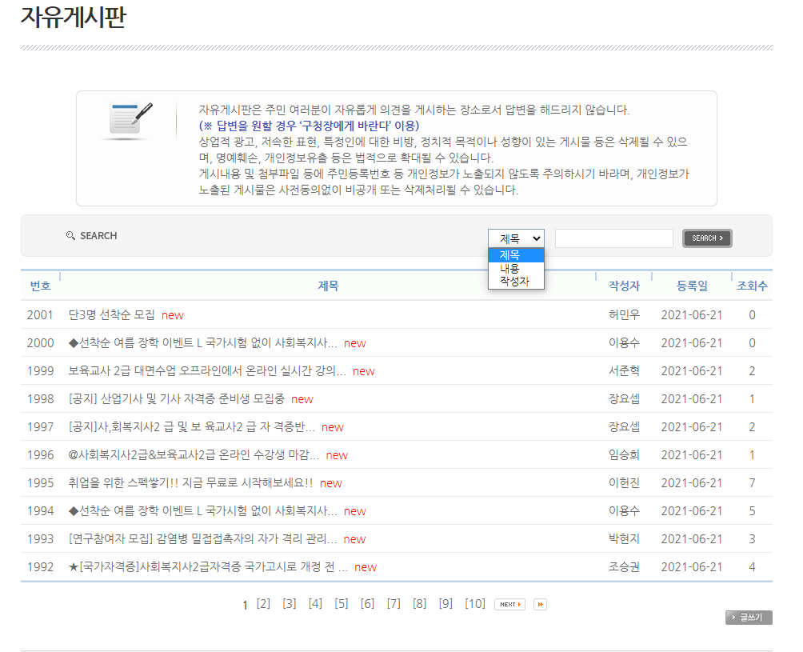
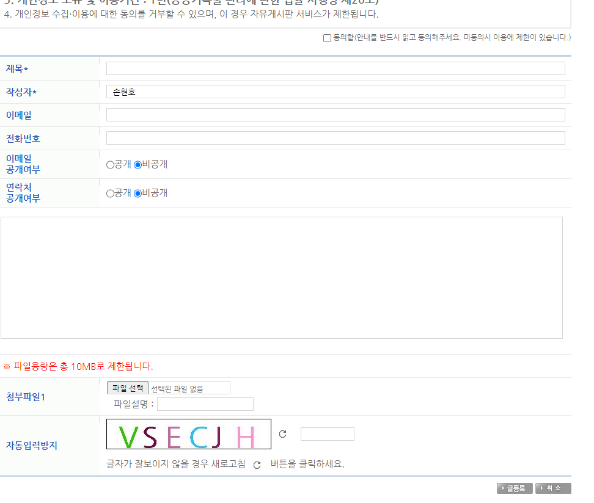
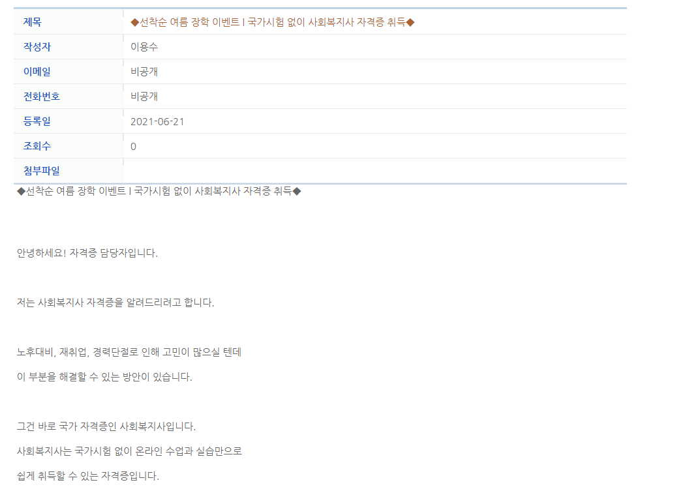
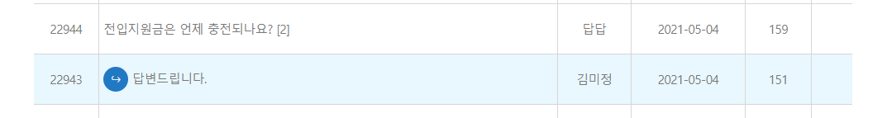

# 자유게시판

### 첫 게시판 목표

- 글 번호
- 글 제목
- 작성자
- 등록일
- 조회수
- 검색기능(제목,작성자,내용)

- 제목(NOT NULL)
- 작성자(NOT NULL,FK?)
- 이메일
- 전화번호
- 이메일 공개여부
- 연락처 공개여부
- 첨부파일 등록

- 게시글에 들어간 제목,작성자 ... 출력

- 게시글 내에서 다음글, 이전글로 이동하는 기능
    - 글 번호로 이동하는 것으로 보임
    - 삭제된 글번호가 존재할 시 그 다음을 보여줄 필요가 있음
    

- 당일 게시물에 대해 new키워드
    - 날짜로 계산할지 시간으로 계산할지 결정

- 답변시 글번호는 다시 부여하는 것인가?
- 답변 관리 미흡으로 글번호가 밀리는 상황이 생기면 답변시에 내부적 글번호 수정이 계속발생?
- 답변가능한 관리자 ID와 일반 ID 구분

필요 테이블

- 글 ( 글 번호(PK), 작성자ID(FK), 작성일 , 작성날짜, 이메일, 전화번호, 이메일,연락처 공개여부)
- 회원 (아이디, 패스워드, 이메일, 전화번호.. 등)
- 첨부파일(첨부파일NO,첨부파일명,첨부파일주소.글번호(FK).등)
- 답글 (답글 NO(PK), 답한글번호(FK),작성자(ID))

